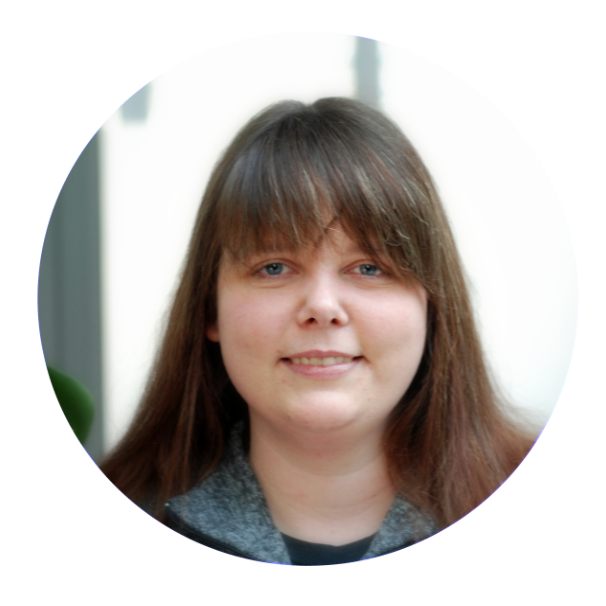

# Wstęp {#intro}

Przedstawiamy mini podręcznik do nauki Pythona i R w Data Science.

Zebrane materiały są częścią warsztatów "PoweR, czyli Python i R w Data Science dla początkujących" organizowanych przez:

- Warszawskie Spotkania Entuzjastów R

- R Ladies Warsaw

- Koło Naukowe Data Science PW

- MI2DataLab

- Wydział Matematyki i Nauk Informacyjnych, Politechnika Warszawska

Nasi prowadzący:

Część 1 - Podstawy języka

**Grupa Python - Kasia Stankiewicz**

_Kasia jest studentką 3 roku Informatyki na MiNI, zakochana w Data Science. Już od kilku lat bierze udział w prowadzeniu różnego rodzaju wykładów i warsztatów. W wolnym czasie jest wiceprezesem Koła Naukowego Data Science na PW i wspina się na skałkach._

**Grupa R - Alicja Gosiewska**

_Alicja jest doktorantką informatyki na Politechnice Warszawskiej związaną z MI2 Data Labem. Uwielbia wprowadzać ludzi w świat programowania w R podczas warsztatów, często wspieranych przez R-Ladies Warsaw. W pracy naukowej zajmuje się wyjaśnialnym uczeniem maszynowym, jest autorką pakietów R takich jak auditor czy iBreakDown._

Część 2 - Formatowanie danych

**Grupa Python - Kuba Wiśniewski**

_Kuba jest studentem Inżynierii i Analizy Danych na Politechnice Warszawskiej. W wolnych chwilach udziela się w Kole Naukowym Data Science. Lubi kontakt z ludźmi, sport i gotowanie._

**Grupa R - Kasia Woźnica**

_Kasia jest doktorantką  Politechniki Warszawskiej  na informatyce. Pracuje też  w MI2 Data Lab. W pracy naukowej zajmuje się automatycznym uczeniem maszynowym. Po godzinach lubi dzielić się z innymi swoimi umiejętnościami z programowania w R, a prowadzenie warsztatów jest ku temu świetną okazją._

Część 3 - Wizualne EDA

**Grupa Python - Wojtek Tyczyński**

_Wojtek jest studentem Fizyki Technicznej na Politechnice Warszawskiej i wiceprezesem Koła Naukowego Data Science. Do jego głównych zainteresowań, poza data science, należy również wykorzystanie machine learningu w fizyce. Ponadto jest zawodnikiem jednej z warszawskich drużyn Futbolu Amerykańskiego._

**Grupa R - Ania Kozak**

_Ania jest studentką Statystyki Matematycznej i Analizy Danych na Politechnice Warszawskiej oraz pracuje jako Data Scientist. Związana z MI2 Data Lab oraz Kołem Naukowym Data Science. W wolnych chwilach organizuje i prowadzi warsztaty (SER Warsaw, R Ladies Warsaw) związane z popularyzacją języka R. Jest autorką pakietu R vivo. Gdy nie programuje jest cukieRnikiem ;)_

