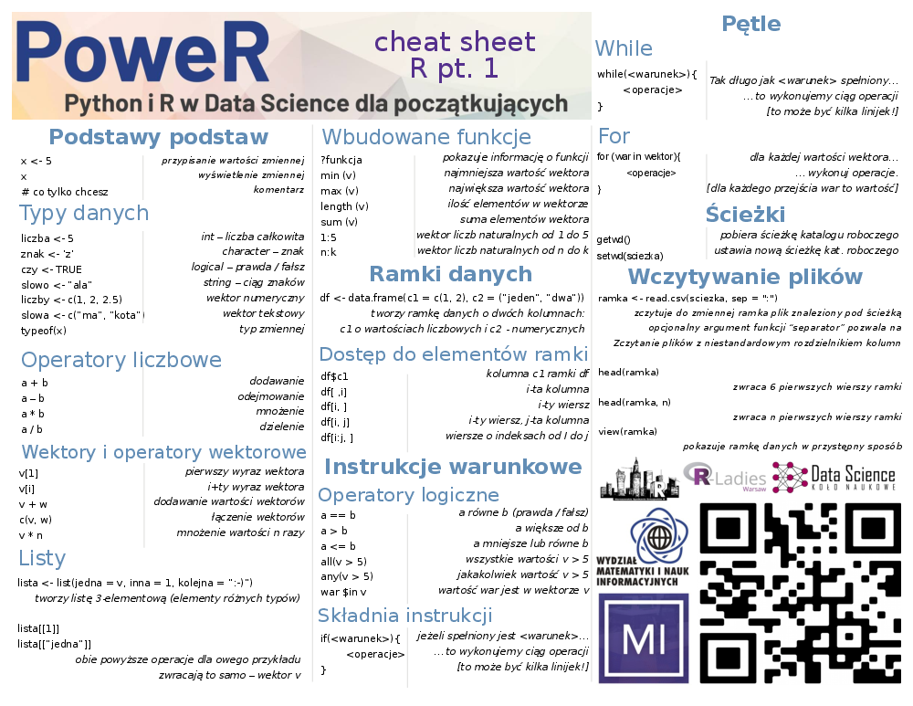
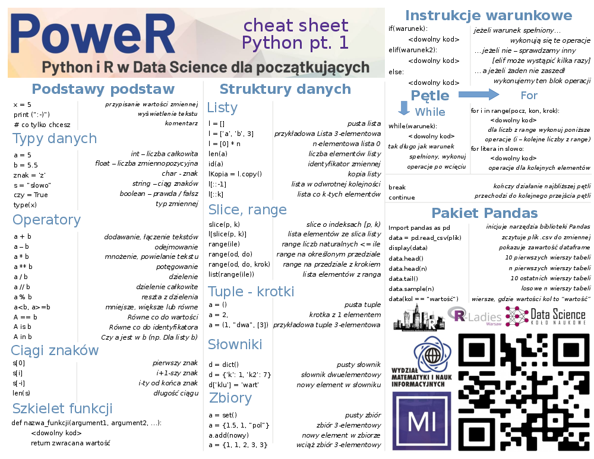

# Podstawy języka {#podstawy-jezyka}

Wstęp do Pythona i R

## R



### Podstawowe operacje

Następujący kod będzie pisany w oprogramowaniu **RStudio**. Jest to najbardziej powszechne środowisko programistyczne *R*-a, integrujące także wiele innych przydatnych funkcjonalności.

R to bardzo wygodne narzędzie w kwestii operacji arytmetycznych. Sprawdźmy jak sprawdzi się dla paru z nich!
```{r}
2 + 2
2 + 2 + 2 + 2
2^4
```

Oprócz wyżej wymienionych można także dokonywać wielu innych obliczeń. Zachowywana jest także kolejność działań.

**Zadanie 1**

Sprawdź czy R zachowuje kolejność dzialań. Jakiego przykladu można uzyć?

*Przykładowe rozwiązanie:*
```{r}
2 + 2 * 2
```

W R-rze istnieją dwie metody przypisania. Głownie używamy składni *x <- 5* (możliwe także *5 -> x*), ale istnieje rownież opcja może bardziej instynktownego *x = 5*. Standardowo przynajmniej na tym etapie lepiej jest jednak używać "strzałki".
```{r}
x <- 5
x
y = 5
zmienna <- "Hello World!"
```

### Struktury danych

Jedną z podstawowych są *wektory*. Służą one do przechowywania pewnej liczby elementów w jednej zmiennej.
```{r}
parzyste <- c(2, 4, 6)
litery <- c("a", "b", "c")
litery[2]
vec <- c(parzyste, litery)
vec
```

Oczywiście i na nich możemy dokonywać różnych operacji.
```{r}
nieparzyste <- c(1, 3, 5)
parzyste + nieparzyste
parzyste * x
```

Inną istotną strukturą są *listy*.
```{r}
liczby <- list(parzyste = parzyste, nieparzyste = nieparzyste)
c(parzyste, nieparzyste)
liczby[[1]]
liczby[["parzyste"]]
```

**Zadanie 2**

a) Stwórz dwa wektory składające się z 5 liczb każdy, a następnie przypisz ich rożnice do nowej zmiennej o nazwie różnica.

b) Połącz te trzy wektory w listę.

*Przykładowe rozwiązanie:*

a)
```{r}
a <- c(1, 2, 3, 4, 5)
b <- c(6, 7, 8, 9, 10)
roznica <- b - a
```
b)
```{r}
lista_wektorow <- list(a, b, roznica)
```

R jest także bogaty w szereg przydatnych funkcji wbudowanych. Oto niektóre z nich i ich działanie:
```{r, eval = FALSE}
?min # zwraca informacje o funkcji
```
```{r, message = FALSE}
min(roznica)
max(roznica)
sum(roznica)
length(roznica)
vec2 <- 1:20
vec2
vec3 <- 50:100
vec3
```

Kolejną bardzo ważną strukturą w R jest *ramka danych*.
```{r}
df <- data.frame(col_1 = c(1, 2, 3), col_2 = c("raz", "dwa", "trzy"))
```

Możemy na niej działać poprzez odpowiednie operatory:
```{r}
df$col_1
df[["col_1"]]
df[3, 1]
df[,1]
df[1,]
df[2:3,]
```

### Instrukcja warunkowa

... to konstrukcja, której używamy W celu dokonywania decyzji o wykonywanych krokach. Najprościej mówiąc owy element języka pozwala na wykonanie ciągu operacji w zależności od zaproponowanego przez programistę warunku. Oto i przykładowe takie warunki:
```{r}
1 == 1
1 == 0
1 > 0
1 < 0
!(1==1)
parzyste
parzyste == 2
all(parzyste == 2)
any(parzyste == 2)
2 %in% parzyste
```

... i sama instrukcja *if* w praktyce:
```{r}
if( !(8 %in% parzyste) ){
  parzyste <- c(parzyste, 8)
}
parzyste

skorupa <- TRUE
if(skorupa == TRUE){
  "zolw"
} else {
  "kot"
}

ifelse(skorupa == TRUE, "zolw", "kot")
```

ifelse działa też na wektorze:
```{r}
skorupa <- c(TRUE, TRUE, FALSE)
ifelse(skorupa == TRUE, "zolw", "kot")
```

**Zadanie 3**

a) Podobnie jak w powyższym przykładzie, wektor liczb nieparzystych powiększ o liczbe 7, o ile już jej nie ma.
b) Dany jest wektor liczb, v <- c(1,2,2,2,2,2,3,3,3,1,1,2). Użyj instrukcji if else lub ifelse, zeby zrobić z niego wektor zawierający wartosci "jeden", "dwa", "trzy".

*Przykładowe rozwiązanie:*

a)
```{r}
if( !(7 %in% nieparzyste) ){
  nieparzyste <- c(nieparzyste, 7)
}
nieparzyste
```

b)
```{r}
v <- 2
ifelse(v == 1, "jeden", ifelse(v == 2, "dwa", "trzy"))
```

### Pętle

Często spotykamy się z sytuacją, kiedy daną operację lub ciąg wielu instrukcji chcemy wykonać wielokrotnie. Do tego właśnie używamy tytułowych konstrukcji.

Dwie najbardziej powszechne to *while* i *for*. Pierwsza z nich działa na podobnej zasadzie jak intrukcja if - z tym wyjątkiem, że warunek sprawdzany jest wielokrotnie - tak długo, aż będzie spełniany.

```{r}
while (length(parzyste) < 10) {
  len <- length(parzyste)
  parzyste <- c(parzyste, parzyste[len] + 2)
}
```

Z drugiej strony for udostępnia nam możliwość wykonania operacji konkretną ilość razy - np. dokonując czynności dla każdej liczby z listy.

```{r}
nieparzyste2 <- c()
for(liczba in parzyste){
  nieparzyste2 <- c(nieparzyste2, liczba - 1)
}
```

**Zadanie 4**

a) Użyj pętli (której?), żeby iterując po wektorze `liczby <- 1:10` stworzyć wektor 10 kolejnych liczb nieparzystych.

b) Czy jest więcej niż jeden sposob?

*Przykładowe rozwiązanie:*
a)
```{r}
nieparzyste3 <- c()
for(x in 1:10){
  nieparzyste3 <- c(nieparzyste3, 2 * x - 1)  
}
```

b) Ależ oczywiście, że tak!

### Pliki i odczyt danych

Bardzo istotnymi funkcjami są *getwd()* i *setwd()* - pierwsza zwraca ścieżkę do roboczego katalogu roboczego, zaś druga umożliwia ustawienie nowej.

```{r, eval = FALSE}
getwd()
setwd("/Users/ja/mojeskrypty")
```

Do odczytania ramki danych możemy użyć funkcji *read.csv* - w tym celu jako pierwszy argument podajemy ścieżkę do naszego pliku, a jako opcjonalny drugi - separator [znak lub ciąg oddzielający kolejne kolumki data frame].

```{r, eval = FALSE}
# seriale <- read.csv("<tu nalezy wkleic sciezke do pliku>", sep=";")
seriale <- read.csv("files/netflix_titles.csv")
```

Zobaczmy efekt wywołania naszej funkcji - operacja *head* zwróci nam kilka pierwszych wierszy, zaś *View* udostępnia estetyczny ogląd tabelki.

```{r, eval = FALSE}
head(seriale)
View(seriale)
```

**Zadanie 5**

a) Wypisz nazwy seriali, które wyszły w 2020 roku.

b) Wybierz podzbiór zawierający Twoje 3 ulubione seriale i przypisz go do nowej zmiennej.

*Przykładowe rozwiązanie:*
a) Tworzymy wektor, który odpowiada kolejnym wierszom z ramki danych, jeśli zawiera TRUE, to znaczy, że serial był wydany w 2020, jeśli FALSE oznacza, że serial byl wydany w innym roku
```{r, eval = FALSE}
ktore_w_2020 <- seriale[["release_year"]] == 2020
```

Możemy użyc wektora TRUE/FALSE do indeksowania wierszy. Poniższe polecenie wybierze tylko te wiersze, w których wektor *ktore_w_2020* przyjął wartość TRUE.
```{r, eval = FALSE}
seriale_2020 <- seriale[ktore_w_2020, ]
```

b)
```{r, eval = FALSE}
moje_seriale <- seriale[c(1, 2, 10), ]
```

## Python



### Podstawy i proste typy

```{python, python.reticulate = FALSE}
print("Hi!")
```

Python jest językiem **interpretowanym** - najprościej mówiąc oznacza to, że jest on tłumaczony i wykonywany "w locie". Tłumaczeniem i wykonywaniem programu zajmuje się specjalny program nazwany interpreterem języka.

Najprostszym typem jest **int** - obejmuje on liczby całkowite.

```{python, python.reticulate = FALSE}
x = 21
print(x)
print(type(x))
y = 0.3
print(y)
print(type(y))
```
```{python, python.reticulate = FALSE}
def fun(x, y):
    return x + y

x = "Data"
y = "Science"
print(fun(x, y))

x = 5
y = 7
print(fun(x, y))
```

Python jest *dynamicznie typowany* i typowanie jest silne - oznacza to, że język nie może niejawnie konwertować wartości różnych typów.

```{python, python.reticulate = FALSE, eval = FALSE}
a = 2
b = 'L'
c = a + b # zwróci błąd
```

Wartości niektórych obiektów mogą ulec zmianie. Obiekty, których wartość może ulec zmianie, są nazywane *mutable*; obiekty, których wartość jest niezmienna po ich utworzeniu, nazywane są *immutable*.

Typ logiczny **bool** to dwie stałe: True i False.
```{python, python.reticulate = FALSE}
a = True
print(a)
print(type(a))
b = False
print(b)
print(type(a))
```

*bool* jest podtypem liczby całkowitej (*int*).

Funkcja *isinstance()* została zaprojektowana specjalnie w celu sprawdzenia, czy dane należą do określonej klasy (typu danych), zaś funkcja *issubclass()* wskazuje, czy określona klasa jest podklasą określonych klas.
```{python, python.reticulate = FALSE}
print(isinstance(True, int))
print(isinstance(False, int))
print(issubclass(bool, int))
```
```{python, python.reticulate = FALSE}
x = True
y = 1
z = False
print(x + y)
print(y + z)
```

W Pythonie wartość liczby całkowitej nie jest ograniczona liczbą bitów i może wzrosnąć do limitu dostępnej pamięci.

W porównaniu do np. *C++* gdzie *int* ma wartości od -2147483648 do 2147483647 - 4 bajty.
```{python, python.reticulate = FALSE}
x = 78
y = -5
z = 100 ** 20
print(type(x), x)
print(type(y), y)
print(type(z), z)
```

Liczby możemy zapisywać także w w ósemkowym, szesnastkowym i binarnym systemie liczbowym.
```{python, python.reticulate = FALSE}
x = 0x1  # szesnastkowy
y = 0o1  # ósemkowy
z = 0b1  # binarny
print(type(x), x)
print(type(y), y)
print(type(z), z)
```

Jest także **float** - typ liczb zmiennoprzecinkowych.
```{python, python.reticulate = FALSE}
x = 0.5
y = -0.5
print(type(x), x)
print(type(y), y)
```
```{python, python.reticulate = FALSE}
x = 0.1 + 0.1
y = 0.1 + 0.1 + 0.1
z = 0.3
s = 0.2
print(x == s)
print("{:.20f}".format(x) )
print("{:.20f}".format(s))
print(y == z)
print("{:.20f}".format(y))
print("{:.20f}".format(z))
```

W celu przechowywania ciągu znaków używamy typu **string**.
```{python, python.reticulate = FALSE, eval = FALSE}
a = 'A wewnątrz można umieścić "cudzysłów"'
b = "A wewnątrz można umieścić 'apostrof'"
```

Trzy pojedyncze apostrofy są wygodne do zapisania tekstu w kilku linijkach.
```{python, python.reticulate = FALSE, eval = FALSE}
c = '''Trzy pojedyncze 
apostrofy'''
```

W celu dokumentacji używamy trzech cudzysłowów.
```{python, python.reticulate = FALSE, eval = FALSE}
d = """Trzy cudzysłowy"""
```

Żeby odwołać się do poszczególnych części słowa *indeksujemy*.
```{python, python.reticulate = FALSE}
a = 'Laura jadła jabłko'
print(type(a), a)
print('len(a): ', len(a)) # sprawdzanie długości słowa
print(type(a[0]), 'a[0]: ', a[0]) # pierwszy element ma indeks 0
print('a[1]: ', a[1])
print('a[len(a) - 1]: ', a[len(a) - 1]) # ostatni element to długość - 1, ponieważ indeksujemy od 0
print('a[-1] = a[len(a) - 1]: ', a[-1]) # indeksy ujemne liczą od ostatniego znaku
print('a[-18] = a[0]: ', a[-18])
```

```{python, python.reticulate = FALSE}
a = 'Laura jadła jabłko'
b = a
print(id(a), a)
print(id(b), b)
a += '!'
print(id(a), a)
print(id(b), b)
```

*Do zastanowienia...*

1. Co znaczy, że język jest dynamicznie typowany?
2. Co znaczy, że język jest interpretowany? Podaj przykłady
3. Jak sprawdzić, czy wartość należy do jakiejś klasy?
4. Jak sprawdzić długość string?
5. Jak napisać wiersz w Pythonie?

### Struktury danych

W zależności od zadania i problemu nasze dane chcemy przechowywać w przeznaczony do tego sposób - w tym celu używamy właśnie tzw. struktur danych. Jedną z najprostszych jest **lista** - zezwala ona na przechowywanie elementów o różnych typach i swobodne odwołanie się do nich, a także łatwe dodawanie i usuwanie wartości.
```{python, python.reticulate = FALSE}
s = [] # pusta lista
print(s)
print(type(s))
print("len:",len(s))
l = [1, 2, 3, 5, 7] # lista elementów typu int
print(l)
print(len(l))
a = [0] * 10 # lista o danym rozmiarze
print(a)
print(len(a))
```

Lista jest także *obiektem iterowalnym* - oznacza to, że jest przystosowana do "lecenia element po elemencie."
```{python, python.reticulate = FALSE}
b = list('lista')
print(b)
print(len(b))
mix = [7,'👻','róża', 3 + 2j] # w listach może być "wszystko"
print(mix)
print(len(mix))
print(type(mix[1]), mix[1]) # indeksujemy
```

Warto przyjrzeć sie liście także patrząc na różnicę *mutable* vs. *immutable*.
```{python, python.reticulate = FALSE}
m = [1, 2, 3]
n = m
print(id(m), m)
print(id(n), n)

m.append("słoń")
print(id(m), m)
print(id(n), n)
```

Przydaje się funkcja *copy()*... bez zaskoczeń tworząca kopię danego obiektu.
```{python, python.reticulate = FALSE}
l = [1, 2, 3, 5, 7]
more_lists = l[:] #slices
more_list2 = l.copy()

print(id(l), l)
print(id(more_lists), more_lists)
print(id(more_list2), more_list2)
```

Bardzo przydatną umiejętnością jest zaznajomienie z obiektem **slice** (pl: wykrojenie?). Służy on do wygodnego tworzenia ciągów arytmetycznych, a także indeksowania po utworzonych sekwencjach.

Składnia *slice()* to **slice(start, stop, step)**.
```{python, python.reticulate = FALSE}
l = [1, 2, 3, 5, 7]
sl = slice(2, 5, 1)

print(type(sl), sl)
print(l[sl])
print(l[2:5:1]) 
print(l)
```

Abstrahując od *wykrojeń*, generalnie odwoływanie się do różnych elementów listy w zależności od potrzeb niemalże zawsze jest bardzo proste i łatwe do napisania - przyjrzyjmy się poniższym przykładom.
```{python, python.reticulate = FALSE}
lis = [1, 2, 3, 5, 7]
print(lis[-1])      # ostatni element
print(lis[-1:])     # ostatni element, ale ...
print(lis[::-1])    # odwrotna kolejność
print(lis[::2])     # elelemty z indeksami parzystymi
print(lis[:-2])     # cała sekwencja poza ostatnimi dwoma elementami 
print(lis[1::2])    # elementy z indeksami nieparzystymi
```

Na pozornie podobnej zasadzie jak *slice* działa **range**. Ten może przyjąć jeden, dwa lub trzy parametry:

* range(stop)
* range(start, stop)
* range(start, stop, step)

Przyjrzyj się kolejnym wywołaniom i pomyśl: czym rożnią się *slice* i *range*?
```{python, python.reticulate = FALSE}
range_ = range(20)
print(type(range_),range_)

a = list(range(20))
b = [range(10, 20, 1)] 
c = list(range(10, 20, 1))
print("a:", a)
print("b:", b)
print("c:", c)
```

*Sprawdź się!*

1. Stwórz listę liczb od 0 do 500
2. Policz sumę wszystkich elementów tej listy
3. Odwróć tę listę
4. Dodaj na początek słowo *PoweR*
5. Stwórz listę parzystych liczb o długości 50
6. Dla stringa "PoweR warsztaty i przygoda!", usuń wszystkie litery z 6 znaku aż do końca, wyświetl otrzymany string (oczekiwana wartość: "PoweR ")
7. Mamy 2 stringi - s1 i s2. Stwórz nowy string dodając s2 w środku s1. Przykładowo:

* Przed: "Supplementary" i "Vector"

* Po: "SupplVectorementary"

8. Policz liczbę wystąpień litery *e* w stringu "PoweR is the best event evER" nie patrząc na wielkość litery (oczekiwana wartość: 7)

... Jedną z naistotniejszych struktur danych w Pythonie są *tuple*, zwane także krotkami.
```{python, python.reticulate = FALSE}
a = () # pusta tuple
print(type(a), a)
a = (1,2,3,4) # deklaracja
print(type(a), a)
a = 1,2,3,4 # inna deklaracja 
print(type(a), a)
a = (1) # ważne są przecinki, a nie nawiasy
print(type(a), a)
a = 1, # tuple z 1 elementem
print(type(a), a)
n_tuple = ("mouse", [8, 4, 6], (1, 2, 3))
print(type(n_tuple), n_tuple)
```

Kolejną ważną strukturą są **słowniki** - ich idea to przechowywania *wartości* pod odpowiednimi *kluczami*. Należy pamiętać, że klucz jest tylko obiektem immutable (hashowalnym) i jeden klucz może mieć tylko jedną wartość (jeżeli będzie dodane kilka par z tym samym kluczem, Python zapisze ostatni). Protip: jeśli chcesz zapisać kolejność, w której elementy zostały dodane do słownika, użyj funkcji *collections.OrderedDict()*.
```{python, python.reticulate = FALSE}
a = dict() # pusty słownik
b = {} # alternatywa na deklaracje pustego słownika
c = {'klucz': 'wartość'}
print(type(a), a)
print(type(b), b)
print(type(c), c)

a['new_key'] = 'new_value'  # Dodajemy nowy element do słownika
a[(7, 8)] = [('a', 'b', 'c'),'🤖']
print(a)
a['new_key'] = '👧'
print(a)
```

Jeśli klucz nie występuje w słowniku, pojawia się error. Żeby tak nie było trzeba dodatkowo zdefiniować zachowanie *\_\_missing\_\_(key)*. Poniższe operacje nie zadziałają poprawnie.
```{python, python.reticulate = FALSE, eval = FALSE}
print(c['nieklucz'])
a[[1, 2]] = 'nie działa'
```

Do przechowywania wartości unikalnych, przyda nam sie **set** - zbiór. Najprościej mówiąc jest to „kontener” zawierający niepowtarzalne elementy w losowej kolejności. Czas sprawdzenia czy jakiś obiekt jest w zbiorze jest stały, w porównaniu do listy albo krotki, w których czas jest liniowo zależny od liczby elementów.
```{python, python.reticulate = FALSE, eval = FALSE}
a = set()
print(type(a), a)

a = {} # nie set , a ...
print(type(a), a)

a = {'a', 'b', 'c', 'd'}
print(type(a), a)

mixed_set = {2.0, "Nicholas", (1, 2, 3)} 
print(type(mixed_set), mixed_set)

mixed_set.add("Katty") 
print(type(mixed_set), mixed_set)
```

Jeżeli chcielibyśmy dodać do zbioru element już w nim będący - set go zignoruje.
```{python, python.reticulate = FALSE, eval = FALSE}
a = {[1,2,3], [1,2,3]}
```

### Operatory

W celu wykonania operacji arytmetycznych i dokonania innych ingerencji między obiektami, składnia jest prosta i nieodbiegająca od standardu innych języków programowania.

**Arytmetyczne:**

* + dodawanie
* - odejmowanie
* * mnożenie
* ** potęgowanie
* / dzielenie -> float
* // dzielenie z zaokrągleniem do najbliższego int w dół
* % reszta z dzielenia

**Porównania:**

* == równe co do wartości
* != różne co do wartości
* *is* zwraca true, jeśli obie zmienne są tym samym obiektem (porównuje wyniki funkcji id, adresy obiektów przechowywane w pamięci)
* *is not* zwraca true, jeśli obie zmienne nie są tym samym obiektem
* < mniejsze
* > większe
* >= większe lub równe
* \<= mniejsze lub równe
* *in* zwraca wartość True, jeśli w obiekcie znajduje się sekwencja o określonej wartości (np litera w stringu)
* *not in* czy obiekt nie jest zawarty w innym obiekcie

**Logiczne:**

* *and* zwraca wartość True, jeśli obie instrukcje są prawdziwe x < 5 and x < 10
* *or* zwraca wartość True, jeśli jedno z wyrażeń jest prawdziwe x < 5 or x < 4
* *not* odwraca wynik, zwraca False, jeśli wynik jest prawdziwy(x < 5 and x < 10)

Trochę o operatorze **in**:
1. W listach są przeszukiwane wszystkie elementy po kolei. Czas wyszukiwania zależy od rozmiaru listy.
2. Dla zbiorów wyszukiwanie nie zależy od rozmiaru zbioru - jest stałe
3. W przypadku słowników wyszukiwane są tylko klucze, czas wyszukiwania nie zależy od liczby elementów w słowniku. Średnio *O(1)*

**Uwaga!** Do porównywania stosujemy tylko *==*. Jest to bardzo ważne, gdyż niedbałe mylenie *==* z *=* to typowy błąd początkujących programistów, który niezwykle często doprowadza do porozumień i zepsucia kodu tylko przez tą jedną literkę, którą niekiedy i wychwycić niełatwo.

Zobaczmy nasze oparatory w akcji.
```{python, python.reticulate = FALSE}
x = 256
y = 256
print('id(x)', id(x))
print('id(y)', id(y))
print('x is y', x is x)
print('x == y', x == y)

x = 257
y = 257
print('id(x)', id(x))
print('id(y)', id(y))
print('x is y', x is y)
print('x == y', x == y)
```

Zwróć uwagę, jak zmieniło się zachowanie Pythona dla operatorów *==* i *is* - dzieje się tak dlatego, że zwzględów optymalizacyjnych liczby "małe" są nieco inaczej interpretowane.

### Instrukcja warunkowa

... to element języka pozwalający na wybór różnych ścieżek operacji w zależności od spełnionych warunków. Kluczowa jest umiejętność użytku i rozumienia instrukcji **if**, **else** i **elif** (skrót od *else if*). Działają one niemalże tak, jak można by się spodziewać po ich tłumaczeniach.

```{python, python.reticulate = FALSE}
x = 10
print('przed ifem')
if x == 10:
    print('x=10')
elif x == 4:
    print('x=4')
elif x == 5:
    print('x=5')
else:
    print('else')
print('po ifie')
```

### Pętle

W celu wykonania danego bloku operacji wiele razy korzystamy z pętli. Tak jak i w przypadku innych popularnych języków programowania, kluczowa jest znajomość **for** i **while**.

Na tą pierwszą najwygodniej patrzeć jak na pętlę "*dla każdego...*". Oto jej działanie:
```{python, python.reticulate = FALSE}
for number in range(5): 
    print(number)
```

Iterować możemy po po dowolnych iterowalnych obiektach.
```{python, python.reticulate = FALSE}
mix = [7,'👻','róża', 3 + 2j] 
for el in mix: 
    print(el)
    
print("==========================================================================")    

for i in 'hello world':
    print(i * 2, end = '')
```

W celu przerwania działania pętli korzystamy z instrukcji **break**, zaś kiedy chcemy rozpocząć następny obrót pętli, omijając pozostałą część - używamy **continue**.
```{python, python.reticulate = FALSE}
for i in 'hello world':
    if i == 'e':
        break
    print(i * 2, end = '')
```

```{python, python.reticulate = FALSE}
for i in 'hello world':
    if i == 'o':
        continue
    print(i * 2, end = '')
```

Przydatna jest też operacja **else** dla pętli - wykona się ona, jeśli pętla zakończyła się normalnie (nie za pomocą *break*).
```{python, python.reticulate = FALSE}
for i in 'hello world':
    if i == 'a':
        break
else:
    print('Nie ma takiej litery')
```

Drugą pętlą jakiej możemy użyć w Pythonie jest **while** - zezwala ona na wykonywanie operacji w bloku kodu jej przeznaczonym tak długo, aż wpisany przez programistę warunek będzie spełniony.

Intuicja: *while* to taki *if* wykonywany wielokrotnie [o ile warunek jest spełniany].
```{python, python.reticulate = FALSE}
i = 5
while i < 15:
    print(i)
    i = i + 2
```

Rezultaty pętli *for* możemy także zapisywać w taki oto skrótowy sposób:
```{python, python.reticulate = FALSE}
squares = []
for x in range(10):
    squares.append(x ** 2)
print(squares)


squares = [x**2 for x in range(10)]
print (squares)

b = [x for x in range(10) if not x%3] # lista liczb podzielnych przez 3 and < 10 
print(b)
```

Można także składać zbiory i słowniki.
```{python, python.reticulate = FALSE}
a = {str(i):i for i in [1,2,3,4,5]} # słownik
print(a)
a = {x for x in  range(10) } # set
print(a)
```

Oraz tuple. Tylko uważaj!
```{python, python.reticulate = FALSE}
a = (x for x in range(10)) # generatory
print(type(a))
print(next(a))
print(next(a))
b = tuple(x for x in range(10)) # tuple
print(type(b))
```

*Sprawdź się!*

1. Mamy 2 listy. Wypisz *True* jeśli pierwszy i ostatni element na liście jest taki sam
2. Zrób listę od 1 do 100 i wypisz wszystkie liczby podzielne przez 5
3. Wypisz taką piramidę

1

2 2

3 3 3

4 4 4 4

5 5 5 5 5

*(Pamiętaj o print (..., end=" "))*

4. Połącz dwie listy tak, że do wynikowej listy z pierwszej będą liczby nie parzyste, a z drugiej parzyste. Przykładowo:

*list1 = [15, 22, 23, 17, 19]*
*list2 = [24, 43, 24, 36, 11]*
*Merged List is [15, 23, 17, 19, 24, 24, 36]*

5. Policz wystąpienia kolejnych elementów i na podstawie tego stwórz słownik. Przykładowo:

*list1 = [121, 43, 87, 121, 23, 43, 43, 43, 87]*
*dict1 = {121: 2, 43: 4, 87: 2, 23: 1}*

6. Rozpakuj krotkę do wartości
7. Zamień wszystkie ostatnie wartości w tuple na 99. Przykładowo:

*l1 = [(10, 20, 40), (40, 50, 60), (70, 80, 90)]*
*result = [(10, 20, 99), (40, 50, 99), (70, 80, 99)]*

8. Mamy listę *mix[string, int , float ...]*. Stwórz nową listę która będzie miała tylko *int*.

### Funkcje

W Pythonie definiuje się je za pomocą słowa kluczowego **def**:
```{python, python.reticulate = FALSE}
def func():
    print("Hi, dear!")

func()
```

W zależności od deklaracji, funkcja może przyjąć dowolną liczbę argumentów o niemalże ograniczonej swobodzie wyboru typów.
```{python, python.reticulate = FALSE}
def greet(name):
    """This function greets to the person passed in as parameter"""
    print("Hello, " + name + ". Good morning!")
    
print(greet.__doc__)
greet("Kate")
```

W przypadku podawania argumentów **pozycyjnie**, podaje się je po nazwie funkcji w nawiasach. Możesz dodać dowolną liczbę argumentów - po prostu oddziel je przecinkiem.
```{python, python.reticulate = FALSE}
def func(name):
    return name + " Ref"

a = func("Katty")
print(a)
print(func("Lila"))
print(func("Ewa"))
```

Można też podawać argumenty **kluczowo**, tj. przez nazwanie. Wtedy kolejność jest nieważna.
```{python, python.reticulate = FALSE}
def func(person3, person2, person1):
    print("Imie ryczerza to " + person3)

func(person1 = "Emil", person2 = "Tobias", person3 = "Linus")
```

```{python, python.reticulate = FALSE}
def func(x = 1, y = 1):
    outcome = x + y
    print(outcome)

func(x = 100)
```

Uwaga z kolejnością argumentów z wartościami *default*! Deklaracja poniższej funkcji nie będzie poprawna.
```{python, python.reticulate = FALSE, eval = FALSE}
def greet(msg = "Good morning!", name):
    pass
```

Można za to napisać w taki sposób:
```{python, python.reticulate = FALSE}
def gree(name, msg = "Good morming!"):
    pass
```

Python daje także możliwość użycia *Args - arbitrary arguments*. Jeśli nie wiesz, ile argumentów zostanie przekazanych do funkcji, dodaj gwiazdkę przed nazwą parametru w definicji funkcji.
```{python, python.reticulate = FALSE}
def func(*args):
    print(type(args))
    print("Imie ryczerza to " + args[2])

func("Emil", "Tobias", "Linus")
```

Są także i *Kwargs - arbitrary keyword arguments*. Jeśli nie wiesz, ile argumentów nazwanych zostanie przekazanych do funkcji, dodaj dwie gwiazdki przed nazwą parametru w definicji funkcji.
```{python, python.reticulate = FALSE, eval = FALSE}
def func_kwargs(**places):
    print("Jestem z " + places["region"] + " województwa")

func_kwargs(city = "Warszawa", region = "Łódzkiego")
```

Pamiętajmy o *Mutable vs. Immutable*! Poniżej niepoprawnie zadeklarowana funkcja i tego efekty:
```{python, python.reticulate = FALSE}
def printing(lista = []):
    lista.append('print')
    for el in lista:
        print(id(lista), el)
        
printing()

li = ['nowe słowo']
print(id(li))
printing(li)

printing()
```

Niżej już poprawna implementacja i jej wywołanie:
```{python, python.reticulate = FALSE}
def printing(lista = None):
    print("Przed if: ",id(lista))
    lista = lista if lista else [] # druga opcja lista or []
    print("Po if: ", id(lista))
    lista.append('print')
    for el in lista:
        print(id(lista), el)

printing()

printing()

l = ['nowe słowo']
print("Przed wywołaniem funkcji: ", id(l))
printing(l)
```

*Sprawdź się!*

1. Napisz program, który znajdzie wszystkie takie liczby, które są podzielne przez 7, ale nie są wielokrotnością 5, od 2000 do 3200 (włącznie). Otrzymane liczby należy wydrukować w oddzielonej przecinkami sekwencji w jednym wierszu.

2. 
Napisz funkcję, która oblicza i drukuje wartość zgodnie z podaną formułą: *Q = (2 \* C \* D) / H*, gdzie:

* C - argument nienazwany - integer
* D - argument nienazwany - integer
* H - nie wiadomo ile jest argumentów nienazwanych (jeżeli więcej niż 1 to zsumować H1 + H2 + H3)

3. Zrób funkcję, przyjmującą listę *tuple*, indeks("i") i wartość("w"). Zamień wszystkie wartości na indeksie "i" w tuple na wartość ("w"). Przykładowo:

*l1 = [(10, 20, 40), (40, 50, 60), (70, 80, 90)]*

*change(l1,1,77)*

*result = [(10, 77, 40), (40, 77, 60), (70, 77, 90)]*

### Ramka danych i *pandas* - mały wstęp

W kolejnych krokach będziemy brać pod lupę dwa rodzaje tabel:

1. **Series** - jest to jednowymiarowa struktura danych („jednowymiarowa tablica”), która może przechowywać wartości i dla każdej wartości ma także unikalny indeks
2. **DataFrame** - dwuwymiarowa (lub więcej) wymiarowa struktura danych - w zasadzie tabela z wierszami i kolumnami. Kolumny mają nazwy, a wiersze indeksy.

**Pandas** to doskonała biblioteka implementująca wiele przydatnych narzedzi do obróbki i pracą nad ramką danych. Aby móc korzystać z jej mocy, musimy wczytać (i ewentualnie zainstalować, jeżeli nie zostało to wcześniej zrobione) pakiet. Standardowo przyjęło się wczytywać go jako *pd* - dodanie do instrukcji wczytywania biblioteki magicznych czterech liter *as pd* zezwoli nam na możliwość odwoływania sie w każdym kolejnym kroku kiedy będziemy potrzebować *pandas* nie do całej sześcioliterowej nazwy pakietu, ale tylko do tych dwóch prostych znaków.

Jeżeli nie masz jeszcze zainstalowanego pakietu *pandas* - użyj instrukcji jak niżej.

```{python, python.reticulate = FALSE, eval = FALSE}
install.packages("pandas")
```

```{python, python.reticulate = FALSE, eval = FALSE}
import pandas as pd
```

Dzięki *pandas* możemy łatwo wczytywać gotowe pliki *.csv*. Instrukcja **read_csv** standardowo przyjmuje dwa argumenty - ścieżkę do pliku i opcjonalnie *delimiter* - sposób, w jaki oddzielone są kolejne wartości w wierszach.
```{python, python.reticulate = FALSE, eval = FALSE}
data = pd.read_csv("files/movies.csv", delimiter = ',')
```

Tak utworzona ramka danych ma swój własny typ.
```{python, python.reticulate = FALSE, eval = FALSE}
print(type(data.head()))
```

Możemy łatwo odwołać się do pierwszych lub ostatnich wierszy data frame za pomocą metod **head()** i **tail()**.
```{python, python.reticulate = FALSE, eval = FALSE}
display(data.tail())
display(data.head())
```

Do zwrócenia losowych rows używamy **sample()**.
```{python, python.reticulate = FALSE, eval = FALSE}
data.sample(5)
```

Możemy także łatwo odwołać się do wierszy spełniających podane kryteria. Przykładowo poniższa instrukcja zwróci nam te, dla których wartość odpowiadająca za *title* przyjmuje "Apaches*.
```{python, python.reticulate = FALSE, eval = FALSE}
data[data.title == "Apaches"]
```

*Sprawdź się!*

1. Sprawdź szczegółowe informacje o *DataFrame*
2. Uzyskaj pierwsze 3 wiersze danych
3. Wyświetl kolumny *title* i *description*
4. Wyświetl kolumny *show_id*, *country*, *data_added* dla wierszy 0, 3, 6, 24
5. Wyświetl wiersze gdzie *release_year* > 2010
6. Wyświetl wiersze, gdzie *director* is *NaN*
7. Policz ile jest takich wierszy jak w punkcie 5.
8. Sprawdź typ kolumny *duration*
9. Sprawdź co to znaczy
10. Zmień nazwę kolumny *title* na *name*
Dodaj nowy wiersz